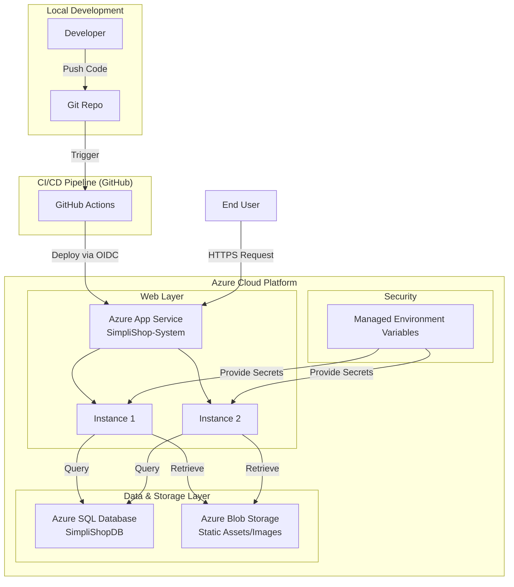

# Architecture Diagram: SimpliShop Cloud Deployment

This diagram illustrates the "Cloud Optimized" architecture for the SimpliShop e-commerce platform on Microsoft Azure.

## Key Architectural Principles Applied:
1.  **Separation of Concerns**: Static assets are offloaded to Azure Storage, while logic is handled by App Service.
2.  **High Availability**: Deployed across multiple instances (Scale-out).
3.  **Security by Design**: Credentials are never stored in code; they are managed via Azure App Service configuration.
4.  **Automation**: Full CI/CD lifecycle using GitHub Actions.
